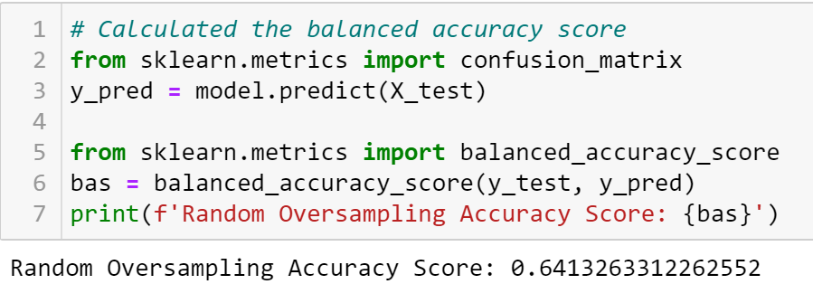

# Credit Risk Analysis

## Overview of the analysis
Credit Risk Anaysis project uses Python to build and evaluate serveral machine learning models to predict credit risk. We employ different techniques to train models with unbalanced classes. Through resampling, we use imbalanced-learn and scikit-learn libraries to perform risk analysis. Our goal is to evaluate the performance of machine learning models and predit credit risk.

## Results
Using bulleted lists, describe the balanced accuracy scores and the precision and recall scores of all six machine learning models. 
### Machine Learning Model
#### Oversampling 
- Naive Random Oversampling
   - Balance Accuracy Score
  
- SMOTE Oversampling
   - Balance Accuracy Score
  
#### Undersampling
- ClusterCentroids
   - Balance Accuracy Score
  
#### Combination Over & Undersampling
- SMOTEENN 
  - Balance Accuracy Score
  
  
#### Ensamble Learners
- Balanced Random Forest Classifier
   - Balance Accuracy Score
  
- Easy Ensemble AdaBoost
   - Balance Accuracy Score
  
  
## Summary
Summarize the results of the machine learning models, and include a recommendation on the model to use, if any. If you do not recommend any of the models, justify your reasoning.
