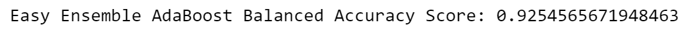

# Credit Risk Analysis

## Overview of the analysis
Credit Risk Anaysis project uses Python to build and evaluate serveral machine learning models to predict credit risk. We employ different techniques to train models with unbalanced classes. Through resampling, we use imbalanced-learn and scikit-learn libraries to perform risk analysis. Our goal is to evaluate the performance of machine learning models and predit credit risk.

## Results
Based on the six machine learning models we have applied to our credit datasets, we could compare the balanced accuracy score, classification report, and confusion matrix as following:

### Oversampling 
#### Naive Random Oversampling
- Balance Accuracy Score

   
   
- Classification Report
 
   
  
- Confusion Matrix:
      https://github.com/FIRE-Phoebe/Credit_Risk_Analysis/blob/a183985b5801f2d8f83e55e80f8a0e716fe37a0b/Resources/Images/cm_ros.PNG
      
#### SMOTE Oversampling
- Balance Accuracy Score
 
  
  
- Classification Report

  
  
- Confusion Matrix:
  https://github.com/FIRE-Phoebe/Credit_Risk_Analysis/blob/a183985b5801f2d8f83e55e80f8a0e716fe37a0b/Resources/Images/cm_SMOTE.PNG
      
### Undersampling
#### Cluster Centroids Undersampling
- Balance Accuracy Score

  
  
- Classification Report

  
  
- Confusion Matrix:
   https://github.com/FIRE-Phoebe/Credit_Risk_Analysis/blob/a183985b5801f2d8f83e55e80f8a0e716fe37a0b/Resources/Images/cm_undersampling.PNG
      
### Combination Over & Undersampling
#### SMOTEENN 
- Balance Accuracy Score

  
  
- Classification Report

  
  
- Confusion Matrix:
  https://github.com/FIRE-Phoebe/Credit_Risk_Analysis/blob/a183985b5801f2d8f83e55e80f8a0e716fe37a0b/Resources/Images/cm_combination.PNG 
      
### Ensamble Learners
#### Balanced Random Forest Classifier
- Balance Accuracy Score

  
  
- Classification Report

  
  
- Confusion Matrix:
  https://github.com/FIRE-Phoebe/Credit_Risk_Analysis/blob/a183985b5801f2d8f83e55e80f8a0e716fe37a0b/Resources/Images/cm_brf.PNG
      
#### Easy Ensemble AdaBoost
- Balance Accuracy Score

  
  
- Classification Report

  
  
- Confusion Matrix:
  https://github.com/FIRE-Phoebe/Credit_Risk_Analysis/blob/a183985b5801f2d8f83e55e80f8a0e716fe37a0b/Resources/Images/cm_eec.PNG
  
## Summary
Summarize the results of the machine learning models, and include a recommendation on the model to use, if any. If you do not recommend any of the models, justify your reasoning.
