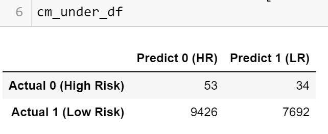

# Credit Risk Analysis

## Overview of the analysis
Credit Risk Anaysis project uses Python to build and evaluate serveral machine learning models to predict credit risk. We employ different techniques to train models with unbalanced classes. Through resampling, we use imbalanced-learn and scikit-learn libraries to perform risk analysis. Our goal is to evaluate the performance of machine learning models and predit credit risk.

## Results
Based on the six machine learning models we have applied to our credit datasets, we could compare the balanced accuracy score, confusion matrix, and classification report as following:

### Oversampling 
#### Naive Random Oversampling

- Balance Accuracy Score: **64.13%**
 
  
- Confusion Matrix:
   - In our analysis, a total *5,445* loans were predicted to have high risk. Only *52* loans actual have high risk. The precision is **0.01**.
   - According to analysis result, there are total *87* loans actually have high risk, and *52* of them were predicted have high risk. The recall is **0.60**.
   

      
    
    
- Classification Report
   - Precision High_risk: ***1%*** 
   - Precision Low_risk: *100%*
   - Recall High_risk: ***60%***
   - Recall Low_risk: *68%*

      

      
#### SMOTE Oversampling
- Balance Accuracy Score: **63.74%**
 
  

- Confusion Matrix:
   - In our analysis, a total *5,578* loans were predicted to have high risk. Only *52* loans actual have high risk. The precision is **0.01**.
   - According to analysis result, there are total *87* loans actually have high risk, and *52* of them were predicted have high risk. The recall is **0.60**.
   

      
    
    
- Classification Report
   - Precision High_risk: ***1%*** 
   - Precision Low_risk: *100%*
   - Recall High_risk: ***60%***
   - Recall Low_risk: *68%*
   
     

      
### Undersampling
#### Cluster Centroids Undersampling
- Balance Accuracy Score: **52.93%**

  

- Confusion Matrix:
   - In our analysis, a total *9,479* loans were predicted to have high risk. Only *53* loans actual have high risk. The precision is **0.01**.
   - According to analysis result, there are total *87* loans actually have high risk, and *53* of them were predicted have high risk. The recall is **0.61**.
   

      
    
    
    
- Classification Report
   - Precision High_risk: ***1%*** 
   - Precision Low_risk: *100%*
   - Recall High_risk: ***61%***
   - Recall Low_risk: *45%*
   
      
  
      
### Combination Over & Undersampling
#### SMOTEENN
- Balance Accuracy Score: **63.76**

  

- Confusion Matrix:
   - In our analysis, a total *7,352* loans were predicted to have high risk. Only *61* loans actual have high risk. The precision is **0.01**.
   - According to analysis result, there are total *87* loans actually have high risk, and *61* of them were predicted have high risk. The recall is **0.70**.
   

      
    
    
    
- Classification Report
   - Precision High_risk: ***1%*** 
   - Precision Low_risk: *100%*
   - Recall High_risk: ***70%***
   - Recall Low_risk: *57%*
   
      
  

      
### Ensamble Learners
#### Balanced Random Forest Classifier
- Balance Accuracy Score: **78.71%**

  

- Confusion Matrix:
   - In our analysis, a total *1,640* loans were predicted to have high risk. Only *58* loans actual have high risk. The precision is **0.04**.
   - According to analysis result, there are total *87* loans actually have high risk, and *58* of them were predicted have high risk. The recall is **0.67**.
   

      
    
    
    
- Classification Report
   - Precision High_risk: ***4%*** 
   - Precision Low_risk: *100%*
   - Recall High_risk: ***67%***
   - Recall Low_risk: *91%*
   
      
  
      
#### Easy Ensemble AdaBoost
- Balance Accuracy Score: **92.55%**

  

- Confusion Matrix:
   - In our analysis, a total *1,057* loans were predicted to have high risk. Only *79* loans actual have high risk. The precision is **0.07**.
   - According to analysis result, there are total *87* loans actually have high risk, and *79* of them were predicted have high risk. The recall is **0.91**.
   

      
    
    
    
- Classification Report
   - Precision High_risk: ***7%*** 
   - Precision Low_risk: *100%*
   - Recall High_risk: ***91%***
   - Recall Low_risk: *94%*
   
      
  
  
## Summary
Summarize the results of the machine learning models, and include a recommendation on the model to use, if any. If you do not recommend any of the models, justify your reasoning.
